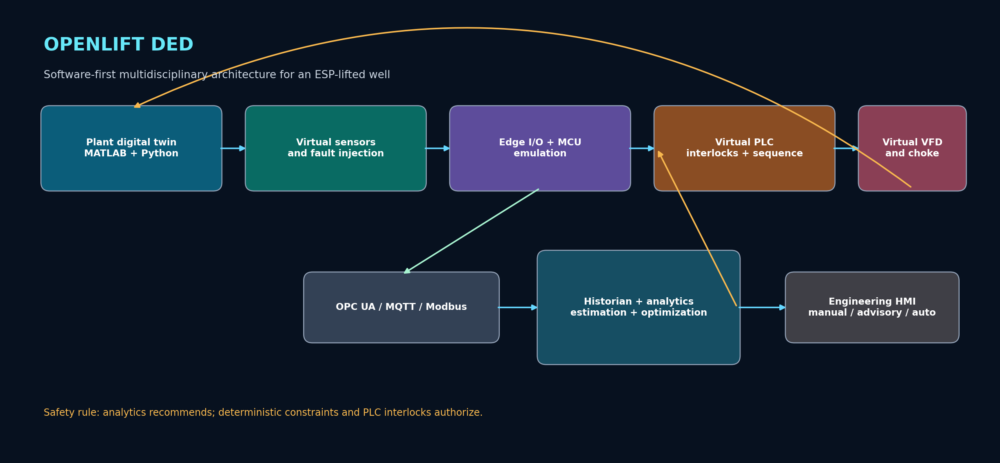
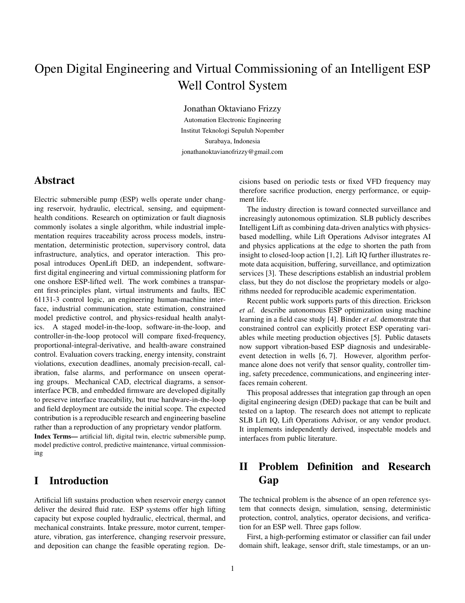

# OpenLift DED

**Digital Engineering Design and Virtual Commissioning of an Intelligent ESP Well Surveillance, Control, and Optimization System**

[](https://github.com/robotjaol/openlift-ded/actions/workflows/ci.yml)
[](LICENSE)
[](pyproject.toml)
[](ROADMAP.md)

OpenLift DED is a software-first, multidisciplinary reference project for an onshore oil well lifted by an electric submersible pump (ESP). It connects a first-principles plant model, virtual sensing, deterministic interlocks, baseline control, industrial interfaces, data analytics, and engineering documentation in one reproducible repository. CAD, electrical, PCB, embedded, PLC, HMI, MATLAB, and Python work packages share a common tag model and requirements baseline.

This is an independent educational and research implementation based only on public information. It does not reproduce SLB software, models, field data, or proprietary workflows and is not certified for field deployment.

## Engineering problem

ESP wells operate under changing reservoir pressure, fluid properties, gas fraction, hydraulic resistance, sensor quality, and equipment health. Fixed-frequency control and fragmented engineering tools can leave production, energy, safety constraints, alarms, and maintenance decisions disconnected. OpenLift DED supplies a traceable laptop-based environment in which those interactions can be designed, tested, and challenged before any physical implementation.

## Proposed system

The reference configuration models one onshore ESP well with a reservoir inflow relationship, tubing and choke losses, a speed-dependent pump, motor and VFD behavior, sensor faults, a supervisory safety layer, and three operating strategies: fixed speed, PID, and a constrained optimizer interface. The baseline release implements the Python plant, PID, interlocks, scenarios, CSV historian, automated tests, and design specifications. The remaining discipline packages are staged through the roadmap and explicitly marked as design baselines rather than completed field hardware.



## Proposal preview

[](proposal/openlift-ded-proposal.pdf)

The editable source is available at [`proposal/openlift-ded-proposal.tex`](proposal/openlift-ded-proposal.tex). The PDF defines the research gap, questions, methodology, validation protocol, acceptance criteria, and limitations.

## What is executable now

```bash
python -m venv .venv
source .venv/bin/activate        # Windows: .venv\Scripts\activate
pip install -e .[dev]
openlift simulate --config configs/reference.yaml --output results/reference-run.csv
openlift benchmark --config configs/reference.yaml --output results/benchmark.json
pytest
```

The simulator uses only NumPy and PyYAML. It is intentionally transparent so that every governing relationship can be inspected, replaced, calibrated, and tested.

## Reference experiment

The bundled campaign applies a reservoir-pressure disturbance and a progressive blockage fault. It compares fixed-frequency and PID operation while the safety layer enforces frequency, ramp-rate, intake-pressure, current, and temperature constraints.

```bash
make reproduce
```

Generated files are written to `results/`. Values are simulation outputs under the assumptions in `docs/physics-model.md`; they are not field-performance claims.

## Repository map

| Path | Engineering work package |
|---|---|
| `engineering/process/` | Basis of design, PFD and P&ID specification |
| `engineering/electrical/` | SLD basis, load list, wiring and protection concept |
| `engineering/instrumentation/` | Instrument index, I/O list and cause-and-effect |
| `engineering/mechanical/` | Parametric CAD scope and interface dimensions |
| `engineering/pcb/` | Edge I/O board requirements and verification plan |
| `embedded/` | MCU acquisition and Modbus firmware baseline |
| `plc/` | IEC 61131-3 state machine and interlock baseline |
| `hmi/` | HMI screen philosophy and shared tag import |
| `matlab/` | MATLAB reference model for equation cross-checking |
| `src/openlift/` | Executable Python plant, control, safety, scenarios and CLI |
| `datasets/` | Public-data acquisition policy and dataset cards |
| `docs/` | Requirements, models, control, validation, safety and reproducibility |
| `proposal/` | IEEE-format proposal, bibliography and compiled PDF |

## Research questions

1. Can constraint-aware control improve production tracking and simulated energy intensity relative to fixed-frequency and PID baselines?
2. Do physics residuals improve anomaly detection under unseen operating conditions compared with raw sensors alone?
3. Can a virtual flow meter remain useful during sensor bias, dropout, delay, and changing reservoir conditions?
4. Does a deterministic safety layer prevent hard-constraint violations when the advisory command is invalid or unavailable?
5. Can the separated software components satisfy their control deadline on a standard laptop?

## Verification hierarchy

| Level | Configuration | Claim permitted |
|---|---|---|
| Model in the loop | Plant and controller in one process | Equation and controller behavior |
| Software in the loop | Services communicate through software interfaces | Integration and timing behavior |
| Controller in the loop | Virtual PLC controls the plant | Virtual commissioning evidence |
| Emulated MCU in the loop | Firmware runs in an emulator | Register and protocol behavior |
| Hardware in the loop | Physical controller is added later | Hardware timing and I/O evidence |

The current public baseline targets the first three levels. True HIL requires physical hardware and is not claimed.

## Safety and proprietary boundary

OpenLift DED is not a production control system. Values, equipment ratings, trip limits, and models are illustrative and must not be used to operate a real well. Hard trips always take precedence over analytics and optimization. See [`docs/safety-and-limitations.md`](docs/safety-and-limitations.md) and [`docs/proprietary-boundary.md`](docs/proprietary-boundary.md).

## Project governance

Requirements use stable identifiers, each acceptance criterion has a planned verification method, and generated evidence is separated from source code. See [`docs/system-requirements.md`](docs/system-requirements.md), [`docs/validation-protocol.md`](docs/validation-protocol.md), and [`ROADMAP.md`](ROADMAP.md).

## Citation

If this project supports academic work, cite the release metadata in [`CITATION.cff`](CITATION.cff). A Zenodo DOI should only be inserted after a tagged public release is archived.

## License

Code and original documentation are released under the [Apache License 2.0](LICENSE). External datasets and vendor materials retain their own licenses and are not redistributed here.

