# PFD · P&ID · PLC

### End-to-End Industrial Automation and Process Control Engineering Laboratory

<p align="center">
  <strong>
    From process engineering diagrams to virtual commissioning, PLC control,
    industrial communication, supervisory systems, and engineering analytics.
  </strong>
</p>

<p align="center">
  PFD / P&ID → I/O Engineering → CODESYS PLC → Factory I/O → HMI/SCADA → OPC UA / Modbus TCP → Industrial Data → Analytics
</p>

<p align="center">
  <a href="#"></a>
  <a href="#"></a>
  <a href="#"></a>
  <a href="#"></a>
</p>

---

## Table of Contents

- [Overview](#overview)
- [Engineering Philosophy](#engineering-philosophy)
- [System Architecture](#system-architecture)
- [Project Objectives](#project-objectives)
- [Reference Architecture](#reference-architecture)
- [Repository Structure](#repository-structure)
- [Planned Industrial Automation Projects](#planned-industrial-automation-projects)
- [PLC Software Architecture](#plc-software-architecture)
- [PLC Programming Principles](#plc-programming-principles)
- [Example Structured Text](#example-structured-text)
- [Factory I/O Integration](#factory-io-integration)
- [I/O Engineering](#io-engineering)
- [Industrial Communication](#industrial-communication)
- [HMI and SCADA](#hmi-and-scada)
- [Alarm Engineering](#alarm-engineering)
- [Fault Injection](#fault-injection)
- [Virtual Commissioning](#virtual-commissioning)
- [Engineering Metrics](#engineering-metrics)
- [Industrial Data Layer](#industrial-data-layer)
- [Future Industrial AI Layer](#future-industrial-ai-layer)
- [Engineering Documentation](#engineering-documentation)
- [Development Roadmap](#development-roadmap)
- [Definition of Done](#definition-of-done)
- [Reproducibility](#reproducibility)
- [Who This Repository Is For](#who-this-repository-is-for)
- [Scope Boundaries](#scope-boundaries)
- [Standards and Engineering References](#standards-and-engineering-references)
- [Contribution Philosophy](#contribution-philosophy)
- [Long-Term Vision](#long-term-vision)
- [Current Focus](#current-focus)
- [Author](#author)
- [License](#license)

---

## Overview

**PFD · P&ID · PLC** is an open engineering repository for designing, implementing, simulating, validating, and documenting industrial automation systems from first principles.

The project connects traditionally separated engineering domains into a reproducible end-to-end workflow:

1. Process understanding
2. Process Flow Diagram development
3. Piping and Instrumentation Diagram interpretation
4. Instrument and I/O definition
5. Control philosophy development
6. PLC software architecture
7. IEC 61131-3 implementation
8. Virtual plant simulation
9. Industrial communication
10. HMI and SCADA integration
11. Alarm and fault management
12. Operational data acquisition
13. Performance analysis
14. Verification and virtual commissioning

The primary automation stack is:

- **CODESYS** for IEC 61131-3 PLC engineering
- **Factory I/O** for virtual industrial plant simulation
- **OPC UA / Modbus TCP** for industrial communication
- **Python** for automation, testing, analytics, and integration
- **Grafana** (or equivalent tooling) for engineering visualization where applicable

The objective is not to create isolated PLC exercises. The objective is to build complete industrial control systems that can be traced from an engineering requirement to a measurable, simulated plant response.

---

## Engineering Philosophy

Industrial automation is more than writing ladder logic. A credible automation system must connect:

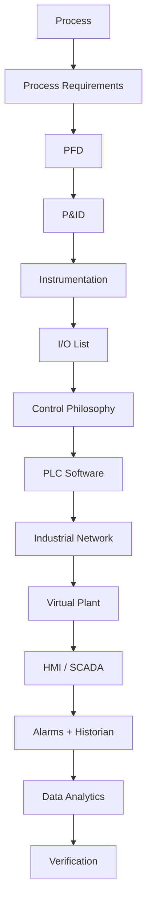

This repository therefore treats PLC programming as one component of a larger cyber-physical control system.

---

## System Architecture

### Core Technology Stack

| Layer | Technology | Purpose |
|---|---|---|
| Process Engineering | PFD / P&ID | Process and instrumentation definition |
| Virtual Plant | Factory I/O | 3D industrial process simulation |
| PLC Engineering | CODESYS | IEC 61131-3 control implementation |
| PLC Language | Structured Text | Primary control implementation |
| Alternative PLC Languages | LD / FBD / SFC | Logic representation where appropriate |
| Industrial Protocol | Modbus TCP | Deterministic PLC/simulator data exchange |
| Interoperability | OPC UA | Structured industrial information exchange |
| Integration | Python | Testing, telemetry, analytics, automation |
| Supervisory Layer | HMI / SCADA | Operator interface and monitoring |
| Data Layer | SQL / Time-Series DB | Historical process data |
| Visualization | Grafana (or equivalent) | Engineering dashboards |
| Version Control | Git + GitHub | Reproducibility and configuration management |

---

## Project Objectives

This repository is designed to demonstrate capability across the complete industrial automation lifecycle.

### Process Engineering
- Read and interpret Process Flow Diagrams
- Read and develop Piping and Instrumentation Diagrams
- Identify process variables
- Define measurement points
- Define manipulated variables
- Define control loops
- Map instruments to automation functions

### PLC Engineering
- IEC 61131-3 programming (Structured Text, Ladder Diagram, Function Block Diagram, Sequential Function Chart)
- State-machine design
- Modular Function Blocks
- Equipment modules
- Interlocks and permissives
- Alarm management and fault handling
- Automatic recovery
- Manual and automatic operating modes

### Control Engineering
- Boolean and sequential control
- Motor, valve, and conveyor control
- PID control and cascade concepts
- Setpoint management, deadband, and hysteresis
- Anti-windup
- Equipment coordination
- Process optimization

### Industrial Systems
- Modbus TCP and OPC UA
- PLC tag mapping
- Network architecture
- Data acquisition and historian integration
- Supervisory monitoring
- Industrial data pipelines

### Verification
- Normal, startup, and shutdown operation testing
- Fault injection (sensor and actuator failure simulation)
- Communication-loss testing
- Interlock and alarm verification
- Recovery testing
- Throughput validation

---

## Reference Architecture

A typical project developed in this repository follows:

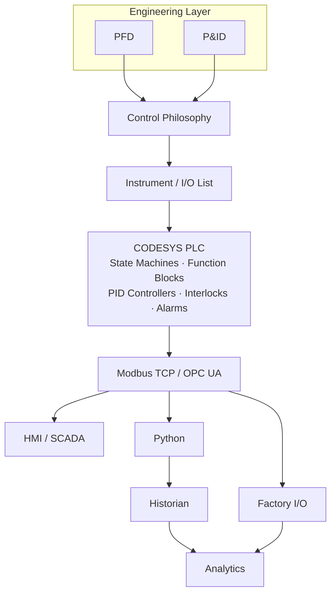

---

## Repository Structure

The repository is progressively evolving toward the following engineering structure:

```text
pfd-p-id/
│
├── README.md
├── LICENSE
├── CONTRIBUTING.md
│
├── 00_docs/
│   ├── project-charter.md
│   ├── system-overview.md
│   ├── architecture.md
│   ├── engineering-assumptions.md
│   └── glossary.md
│
├── 01_process-engineering/
│   ├── pfd/
│   ├── process-description/
│   ├── operating-philosophy/
│   └── process-data/
│
├── 02_p-and-id/
│   ├── drawings/
│   ├── instrument-index/
│   ├── equipment-list/
│   ├── valve-list/
│   └── loop-definition/
│
├── 03_control-philosophy/
│   ├── control-narrative/
│   ├── cause-and-effect/
│   ├── interlock-matrix/
│   ├── permissive-matrix/
│   └── alarm-philosophy/
│
├── 04_io-engineering/
│   ├── io-list/
│   ├── tag-database/
│   ├── signal-mapping/
│   └── address-map/
│
├── 05_codesys/
│   ├── project/
│   ├── programs/
│   ├── function-blocks/
│   ├── data-types/
│   ├── global-variable-lists/
│   ├── state-machines/
│   ├── pid/
│   ├── alarms/
│   └── libraries/
│
├── 06_factory-io/
│   ├── scenes/
│   ├── io-mapping/
│   ├── screenshots/
│   └── commissioning/
│
├── 07_industrial-network/
│   ├── modbus-tcp/
│   ├── opc-ua/
│   ├── network-architecture/
│   └── tag-mapping/
│
├── 08_hmi-scada/
│   ├── screens/
│   ├── alarm-system/
│   ├── trends/
│   └── operator-philosophy/
│
├── 09_data-platform/
│   ├── python/
│   ├── database/
│   ├── historian/
│   ├── telemetry/
│   └── dashboards/
│
├── 10_testing/
│   ├── test-plan/
│   ├── unit-tests/
│   ├── integration-tests/
│   ├── fault-injection/
│   ├── fat/
│   └── validation-results/
│
├── 11_case-studies/
│   ├── conveyor-sorting/
│   ├── tank-control/
│   ├── production-line/
│   ├── material-handling/
│   └── smart-manufacturing/
│
├── 12_performance/
│   ├── throughput/
│   ├── cycle-time/
│   ├── oee/
│   ├── energy/
│   └── reliability/
│
├── 13_media/
│   ├── architecture/
│   ├── diagrams/
│   ├── screenshots/
│   ├── videos/
│   └── demos/
│
└── references/
    ├── pfd/
    ├── p-and-id/
    ├── plc/
    ├── standards/
    └── literature/
```

> Existing repository material (`design-p&id/`, `pfd/`, `plc/`) will progressively be incorporated into this structure rather than discarded.

Every major project follows the same engineering lifecycle: **Requirement → PFD → P&ID → Control Philosophy → I/O → PLC → Virtual Plant → Communication → HMI → Test → Analytics.**

---

## Planned Industrial Automation Projects

### Project 01 — Conveyor Sorting System
**Status:** Planned

A modular automated conveyor system for detection, classification, routing, and rejection.

**Functions:** product detection · conveyor sequencing · classification logic · diverter control · reject handling · product counting · jam detection · interlocks · fault recovery · throughput measurement

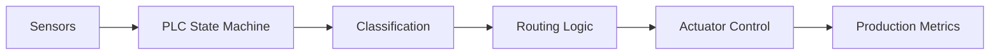

### Project 02 — Automated Material Handling System
**Status:** Planned

A multi-zone material handling system demonstrating coordination between conveyors, buffers, sensors, and actuators.

**Functions:** zone control · buffer management · merge/diverter logic · queue management · anti-collision · anti-deadlock logic · equipment handshake · automatic restart · fault isolation

### Project 03 — Tank Level Control
**Status:** Planned

A closed-loop process control system using simulated process instrumentation.

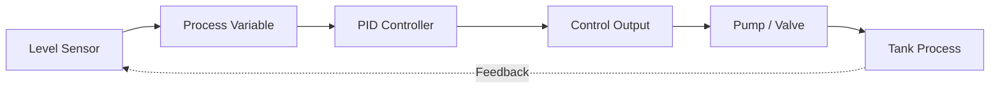

**Engineering scope:** analog I/O · scaling · PID · setpoint management · anti-windup · high-high / low-low level protection · alarm generation · trend analysis · disturbance rejection

### Project 04 — Batch Process Automation
**Status:** Planned

ISA-88-inspired batch sequencing for a simulated process plant.

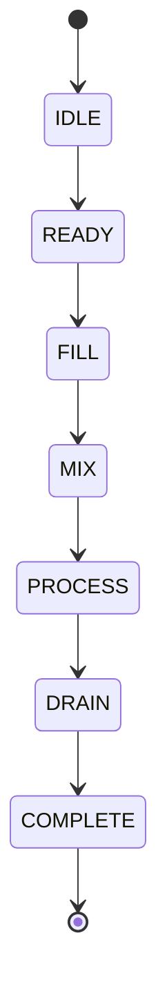

**Includes:** recipe parameters · equipment states · sequence transitions · hold/abort/reset · interlocks · alarm handling · batch metrics

### Project 05 — Smart Manufacturing Cell
**Status:** Planned Flagship Project

The flagship implementation integrates multiple engineering layers into a single virtual manufacturing system.

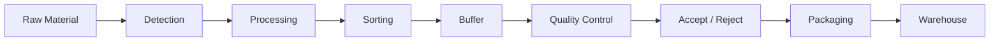

| Domain | Scope |
|---|---|
| Control | Modular equipment control, state machines, interlocks, permissives, sequencing, fault handling, recovery logic, PID where applicable |
| Supervisory | Production status, machine status, alarm summary, equipment modes, trends, operator commands |
| Analytics | Throughput, cycle time, availability, performance, quality, OEE, downtime, fault frequency, energy indicators |

---

## PLC Software Architecture

PLC applications are designed around modular software components rather than monolithic control logic.

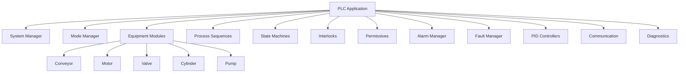

**Example equipment state model:**

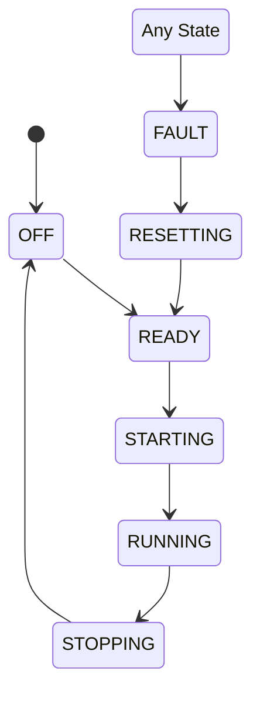

---

## PLC Programming Principles

**Deterministic behavior** — Control behavior should be predictable for every defined plant state.

**Explicit state management** — Sequences use clearly defined states rather than uncontrolled combinations of Boolean conditions.

**Modular design** — Equipment behavior is encapsulated into reusable Function Blocks where practical.

**Safe default states** — Loss of command, communication, or a required permissive transitions equipment toward a defined safe state.

**Separation of concerns:**

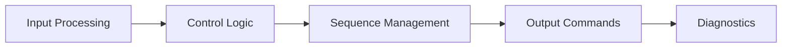

**Traceability:**


---

## Example Structured Text

```pascal
CASE eState OF

    STATE_IDLE:
        xMotorCmd := FALSE;

        IF xStartCmd AND xPermissiveOK THEN
            eState := STATE_STARTING;
        END_IF

    STATE_STARTING:
        xMotorCmd := TRUE;

        IF xMotorRunning THEN
            eState := STATE_RUNNING;
        ELSIF xStartTimeout THEN
            eState := STATE_FAULT;
        END_IF

    STATE_RUNNING:
        xMotorCmd := TRUE;

        IF NOT xPermissiveOK THEN
            eState := STATE_FAULT;
        ELSIF xStopCmd THEN
            eState := STATE_STOPPING;
        END_IF

    STATE_STOPPING:
        xMotorCmd := FALSE;

        IF NOT xMotorRunning THEN
            eState := STATE_IDLE;
        END_IF

    STATE_FAULT:
        xMotorCmd := FALSE;

        IF xResetCmd AND xFaultCleared THEN
            eState := STATE_IDLE;
        END_IF

END_CASE;
```

> The implementation above is intentionally simplified. Production-oriented examples will include diagnostics, timing supervision, mode management, command arbitration, and defined failure behavior.

---

## Factory I/O Integration

Factory I/O provides the virtual physical layer.

| Category | Examples |
|---|---|
| Inputs | Photoelectric sensors, inductive sensors, capacitive sensors, position sensors, level transmitters, push buttons, emergency commands, operator requests |
| Outputs | Conveyors, motors, pumps, valves, cylinders, diverters, stack lights, alarms |

**Basic integration architecture:**

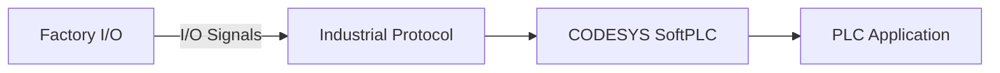

---

## I/O Engineering

Example signal definition:

| Tag | Type | Description | PLC Direction |
|---|---|---|---|
| `PE_ENTRY` | BOOL | Entry photoelectric sensor | Input |
| `PE_EXIT` | BOOL | Exit photoelectric sensor | Input |
| `MTR_CONV_RUN` | BOOL | Conveyor motor command | Output |
| `DIVERT_CMD` | BOOL | Product diverter command | Output |
| `LEVEL_PV` | REAL | Tank level measurement | Input |
| `VALVE_CMD` | REAL | Control valve output | Output |

Formal projects will maintain a complete I/O list with: tag, description, signal type, engineering unit, range, PLC address, equipment, alarm limits, fail state, and communication mapping.

---

## Industrial Communication

### Modbus TCP
Used for straightforward register and coil mapping between industrial components.

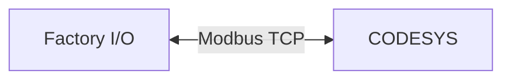

### OPC UA
Used for structured interoperability and higher-level data integration.

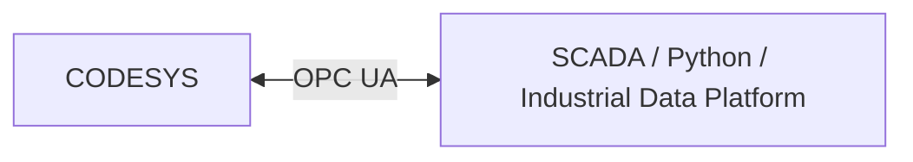

---

## HMI and SCADA

The supervisory layer provides operators with the information required to understand and safely operate the process.

**Planned interfaces:** process overview · equipment status and commands · operating modes · alarm summary and history · process trends · production counters · diagnostics · maintenance indicators

The project deliberately separates:

| Layer | Responsibility |
|---|---|
| **CONTROL** (PLC) | Deterministic control and protection |
| **SUPERVISION** (HMI/SCADA) | Visibility, operator interaction, and reporting |

---

## Alarm Engineering

Alarm logic should be actionable rather than simply reporting every abnormal Boolean state.

**Example alarm hierarchy:** process alarm → equipment alarm → control alarm → communication alarm → safety-related condition

**Example events:** motor start failure, conveyor jam, sensor contradiction, high/low process level, actuator timeout, communication loss, invalid operating state

---

## Fault Injection

Fault injection is a core part of this repository. A system is not considered validated merely because it operates correctly under nominal conditions.

**Planned test scenarios:** sensor stuck ON/OFF · missing product · conveyor jam · motor failure · actuator timeout · unexpected object · communication loss · process disturbance · invalid operator command · PLC restart · sequence interruption

Each fault should define:
- Detection mechanism
- PLC response
- Alarm response
- Safe state
- Operator recovery procedure
- Automatic recovery behavior where permitted

---

## Virtual Commissioning

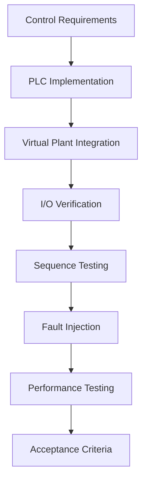

The goal is to detect control defects before physical hardware commissioning.

---

## Engineering Metrics

| Category | Metrics |
|---|---|
| Control | Rise time, settling time, overshoot, steady-state error, disturbance rejection |
| Manufacturing | Cycle time, throughput, production rate, reject rate, buffer utilization, equipment utilization |
| Reliability | Fault count, fault frequency, recovery time, availability, downtime |
| Operational | Availability, performance, quality → **OEE = Availability × Performance × Quality** |

---

## Industrial Data Layer

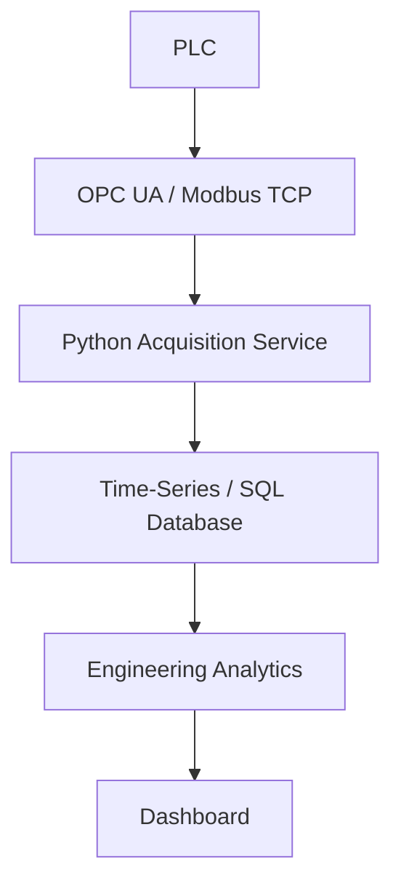

**Potential analytics:** cycle-time distribution, bottleneck identification, equipment utilization, alarm frequency, downtime analysis, production trend, energy intensity, predictive indicators

---

## Future Industrial AI Layer

Industrial AI is intentionally positioned **after** deterministic automation has been implemented and validated.

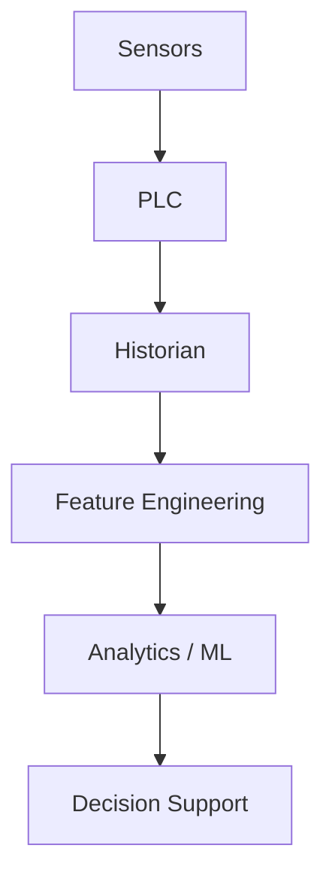

**Potential future experiments:** anomaly detection, predictive maintenance, remaining useful life estimation, process quality prediction, cycle-time prediction, bottleneck detection, energy optimization

> AI outputs should initially remain advisory, while safety-critical and deterministic control remains inside the PLC layer.

---

## Engineering Documentation

Each mature case study should eventually contain:

1. Requirements
2. Process Description
3. PFD
4. P&ID
5. Instrument Index
6. I/O List
7. Control Philosophy
8. Cause & Effect
9. PLC Architecture
10. PLC Source
11. Factory I/O Scene
12. Communication Mapping
13. HMI
14. Test Specification
15. Fault Injection
16. Validation Results
17. Performance Analysis
18. Lessons Learned

This structure makes each project reproducible and auditable.

---

## Development Roadmap

### Phase 0 — Engineering Foundation
- [ ] Collect PFD references
- [ ] Collect P&ID references
- [ ] Collect PLC engineering references
- [ ] Normalize repository structure
- [ ] Create engineering documentation templates

### Phase 1 — CODESYS Foundation
- [ ] Install and configure CODESYS
- [ ] Configure virtual PLC runtime
- [ ] Structured Text fundamentals
- [ ] Function Block architecture
- [ ] State-machine implementation
- [ ] Alarm framework
- [ ] Interlock framework

### Phase 2 — Factory I/O Integration
- [ ] Install Factory I/O
- [ ] Establish PLC communication
- [ ] Digital I/O mapping
- [ ] Analog I/O mapping
- [ ] Validate deterministic scan behavior
- [ ] Document communication architecture

### Phase 3 — First End-to-End Cell
- [ ] Create conveyor system
- [ ] Define PFD / process representation
- [ ] Create simplified P&ID
- [ ] Build I/O list
- [ ] Implement CODESYS logic
- [ ] Connect Factory I/O
- [ ] Perform virtual commissioning
- [ ] Publish test evidence

### Phase 4 — Process Control
- [ ] Simulated process variables
- [ ] PID implementation
- [ ] Alarm limits
- [ ] Process disturbance testing
- [ ] Controller performance evaluation

### Phase 5 — Smart Manufacturing
- [ ] Multi-machine line
- [ ] Buffer management
- [ ] Material routing
- [ ] Fault recovery
- [ ] OEE
- [ ] Production analytics

### Phase 6 — Industrial Data Platform
- [ ] OPC UA integration
- [ ] Python data acquisition
- [ ] Database integration
- [ ] Historian
- [ ] Engineering dashboards
- [ ] Automated reporting

### Phase 7 — Advanced Automation
- [ ] Predictive maintenance experiments
- [ ] Anomaly detection
- [ ] Energy monitoring
- [ ] Digital twin experiments
- [ ] Hardware-in-the-loop extension

---

## Definition of Done

A project is not considered complete when the PLC program merely runs. A project should demonstrate:

- [ ] Engineering requirements
- [ ] Process definition
- [ ] Instrumentation definition
- [ ] I/O documentation
- [ ] PLC architecture and source code
- [ ] Virtual plant integration
- [ ] Network mapping
- [ ] Normal and abnormal operating scenarios
- [ ] Interlock testing
- [ ] Fault injection and recovery procedure
- [ ] Performance measurements
- [ ] Reproducible documentation

---

## Reproducibility

The long-term goal is for another engineer to be able to:

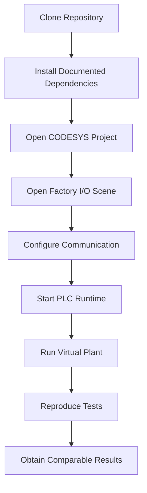

...without relying on undocumented configuration.

---

## Who This Repository Is For

- Automation engineers
- Control engineers
- Electrical engineers
- Instrumentation engineers
- PLC programmers
- Manufacturing engineers
- Process engineers
- Industrial software engineers
- Mechatronics engineers
- Students studying industrial automation
- Engineers transitioning toward Industry 4.0 systems

---

## Scope Boundaries

This repository is an educational and engineering research environment. Virtual commissioning cannot replace all activities required for real industrial deployment.

Real installations additionally require appropriate consideration of: functional safety, electrical protection, machinery safety, cybersecurity, hazard analysis, process safety, regulatory requirements, vendor requirements, physical commissioning, site acceptance testing, and maintenance procedures.

> No example in this repository should be interpreted as certified production control logic without independent engineering review and validation.

---

## Standards and Engineering References

Where applicable, future implementations may reference concepts from:

- IEC 61131-3
- IEC 62443
- ISA-88
- ISA-95
- ISA-18.2
- OPC UA specifications
- Modbus Application Protocol
- Relevant process instrumentation conventions
- Applicable machine and functional safety standards

> A standard being referenced does not imply formal compliance or certification unless explicitly demonstrated.

---

## Contribution Philosophy

Contributions should improve engineering quality rather than merely increase repository size.

**High-value contributions include:** improved PLC architecture, additional Factory I/O scenarios, better failure-mode handling, test automation, control-system validation, industrial communication examples, documentation improvements, engineering calculations, reproducibility improvements.

Please keep contributions: **technically justified · reproducible · documented · modular · testable.**

---

## Long-Term Vision

The long-term goal is to evolve this repository into a vendor-neutral industrial automation engineering laboratory covering the path from process definition to operational intelligence.

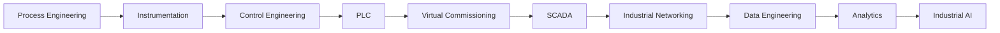

Rather than demonstrating individual software packages, the repository aims to demonstrate the engineering discipline required to integrate them into one coherent industrial system.

---

## Current Focus

The immediate development focus is:

**CODESYS + Factory I/O end-to-end virtual industrial automation.**

Starting from a process definition and I/O architecture, the project will progressively implement:

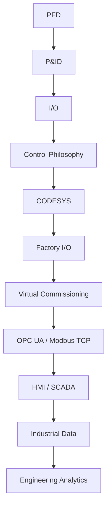

---

## Author

**Jonathan Oktaviano Frizzy**
Automation · Control Systems · Industrial Digitalization · Industrial AI

GitHub: [@robotjaol](https://github.com/robotjaol)

---

## License

A formal open-source license will be defined as the repository transitions from reference material toward original implementation.

Third-party documents, software, trademarks, and reference materials remain subject to their respective licenses and ownership.