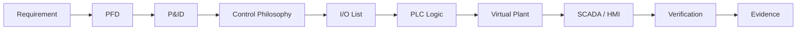
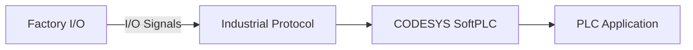
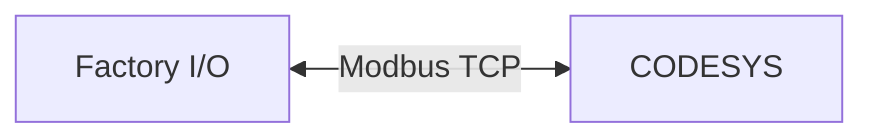
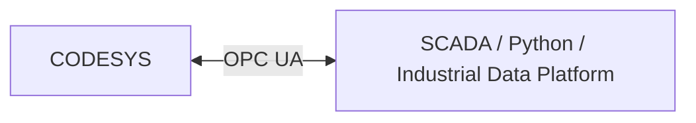
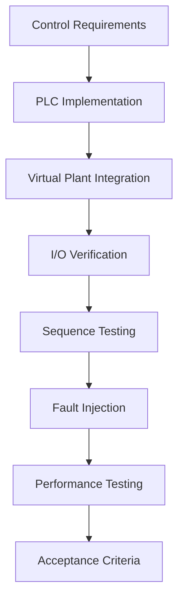
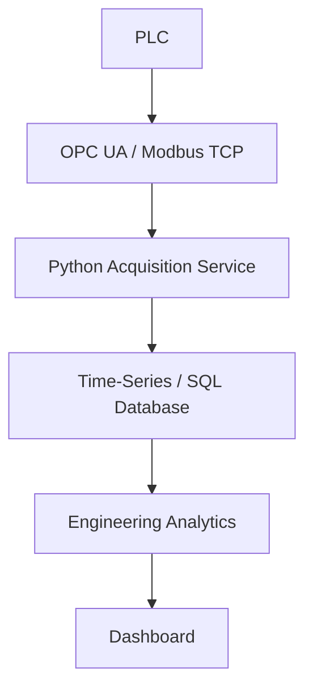
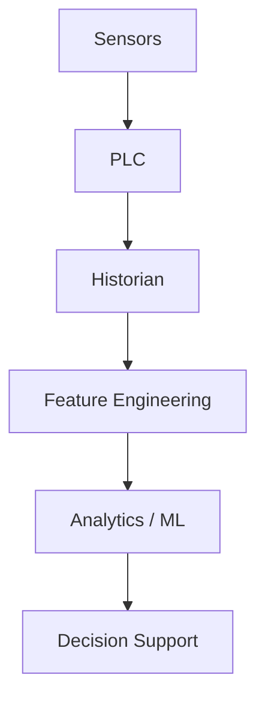
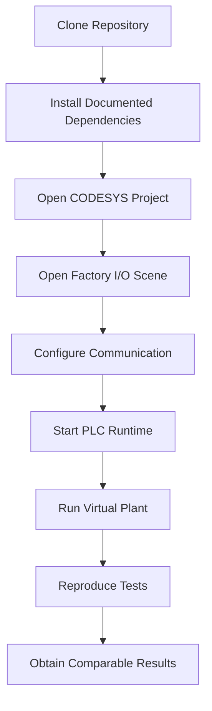
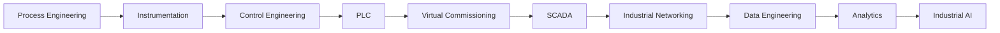
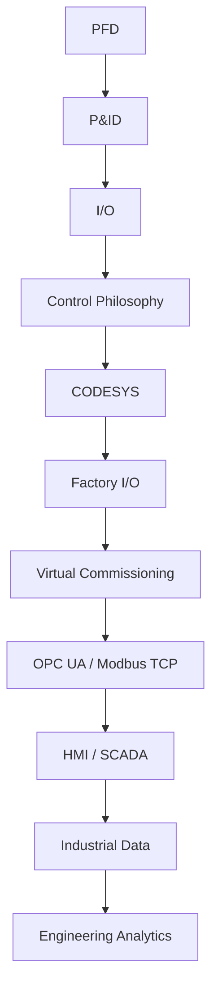

# PFD · P&ID · PLC

A professional engineering repository for industrial automation, process design, PLC logic, and virtual commissioning.

<p align="center">
  <a href="#overview"></a>
  <a href="#technology-stack"></a>
  <a href="LICENSE"></a>
</p>

## Overview

This repository brings together process engineering, instrumentation, PLC implementation, simulation, and digital validation into one reusable engineering workspace.

The core objective is to move beyond isolated PLC exercises and instead create systems that can be traced from requirement to simulation, logic implementation, and evidence-based verification.

## Why this repository exists

Industrial automation projects work best when they link the following domains together:

- Process flow and process design
- PFD and P&ID interpretation
- Instrumentation and I/O definition
- Control philosophy and interlocks
- PLC implementation and state-based logic
- Factory I/O or virtual plant simulation
- Industrial communication such as Modbus TCP and OPC UA
- SCADA, alarms, trends, and operational visibility
- Verification, testing, and evidence capture

## Technology stack

| Layer | Tools |
|---|---|
| Process engineering | PFD, P&ID, engineering documentation |
| PLC engineering | CODESYS, IEC 61131-3 |
| Simulation | Factory I/O |
| Communications | Modbus TCP, OPC UA |
| Integration | Python, CSV, telemetry workflows |
| Version control | Git, GitHub |

## Repository structure

```text
pfd-p-id/
├── README.md
├── LICENSE
├── CONTRIBUTING.md
├── SECURITY.md
├── CODE_OF_CONDUCT.md
├── .editorconfig
├── .gitignore
├── .github/
│   ├── CODEOWNERS
│   ├── dependabot.yml
│   ├── pull_request_template.md
│   ├── ISSUE_TEMPLATE/
│   │   ├── bug_report.yml
│   │   ├── feature_request.yml
│   │   └── config.yml
│   └── workflows/
│       └── markdown-check.yml
├── docs/
│   ├── README.md
│   └── roadmap.md
├── design-p&id/
├── pfd/
├── plc/
├── project/
│   └── project-1-industrial-sorting-cell/
│       ├── README.md
│       ├── docs/
│       ├── plc/
│       ├── factoryio/
│       ├── screenshots/
│       ├── LICENSE
│       ├── PROJECT_STATUS.md
│       └── SECURITY.md
└── references/
```

## Featured project

The current working implementation is the sorting cell portfolio project:

- [project/project-1-industrial-sorting-cell/README.md](project/project-1-industrial-sorting-cell/README.md)

This project demonstrates:

- automated material handling
- state-based PLC sequencing
- interlocks and fault handling
- Modbus TCP communication with Factory I/O
- documentation and validation traceability

## Engineering workflow



## Quick start

1. Review the repository overview in [README.md](README.md).
2. Open the active project in [project/project-1-industrial-sorting-cell](project/project-1-industrial-sorting-cell).
3. Read the design and test materials in the project docs folder.
4. Validate the PLC logic and Factory I/O integration in your local engineering environment.
5. Contribute back using the guidance in [CONTRIBUTING.md](CONTRIBUTING.md).

## Documentation

- [docs/README.md](docs/README.md)
- [docs/roadmap.md](docs/roadmap.md)
- [project/project-1-industrial-sorting-cell/README.md](project/project-1-industrial-sorting-cell/README.md)

## Contributing

We welcome improvements, corrections, and new industrial automation examples.

Please read [CONTRIBUTING.md](CONTRIBUTING.md) before submitting a change.

## Security

Please report security issues through the process defined in [SECURITY.md](SECURITY.md).

## License

This project is licensed under the [MIT License](LICENSE).

## Project status

This repository is in active engineering development and is structured to support a portfolio of PLC and industrial automation case studies.

The current focus is the sorting cell implementation, with a broader long-term goal to expand into additional industrial automation examples across process, material handling, and digital manufacturing domains.
        END_IF

    STATE_RUNNING:
        xMotorCmd := TRUE;

        IF NOT xPermissiveOK THEN
            eState := STATE_FAULT;
        ELSIF xStopCmd THEN
            eState := STATE_STOPPING;
        END_IF

    STATE_STOPPING:
        xMotorCmd := FALSE;

        IF NOT xMotorRunning THEN
            eState := STATE_IDLE;
        END_IF

    STATE_FAULT:
        xMotorCmd := FALSE;

        IF xResetCmd AND xFaultCleared THEN
            eState := STATE_IDLE;
        END_IF

END_CASE;
```

> The implementation above is intentionally simplified. Production-oriented examples will include diagnostics, timing supervision, mode management, command arbitration, and defined failure behavior.

---

## Factory I/O Integration

Factory I/O provides the virtual physical layer.

| Category | Examples |
|---|---|
| Inputs | Photoelectric sensors, inductive sensors, capacitive sensors, position sensors, level transmitters, push buttons, emergency commands, operator requests |
| Outputs | Conveyors, motors, pumps, valves, cylinders, diverters, stack lights, alarms |

**Basic integration architecture:**



---

## I/O Engineering

Example signal definition:

| Tag | Type | Description | PLC Direction |
|---|---|---|---|
| `PE_ENTRY` | BOOL | Entry photoelectric sensor | Input |
| `PE_EXIT` | BOOL | Exit photoelectric sensor | Input |
| `MTR_CONV_RUN` | BOOL | Conveyor motor command | Output |
| `DIVERT_CMD` | BOOL | Product diverter command | Output |
| `LEVEL_PV` | REAL | Tank level measurement | Input |
| `VALVE_CMD` | REAL | Control valve output | Output |

Formal projects will maintain a complete I/O list with: tag, description, signal type, engineering unit, range, PLC address, equipment, alarm limits, fail state, and communication mapping.

---

## Industrial Communication

### Modbus TCP
Used for straightforward register and coil mapping between industrial components.



### OPC UA
Used for structured interoperability and higher-level data integration.



---

## HMI and SCADA

The supervisory layer provides operators with the information required to understand and safely operate the process.

**Planned interfaces:** process overview · equipment status and commands · operating modes · alarm summary and history · process trends · production counters · diagnostics · maintenance indicators

The project deliberately separates:

| Layer | Responsibility |
|---|---|
| **CONTROL** (PLC) | Deterministic control and protection |
| **SUPERVISION** (HMI/SCADA) | Visibility, operator interaction, and reporting |

---

## Alarm Engineering

Alarm logic should be actionable rather than simply reporting every abnormal Boolean state.

**Example alarm hierarchy:** process alarm → equipment alarm → control alarm → communication alarm → safety-related condition

**Example events:** motor start failure, conveyor jam, sensor contradiction, high/low process level, actuator timeout, communication loss, invalid operating state

---

## Fault Injection

Fault injection is a core part of this repository. A system is not considered validated merely because it operates correctly under nominal conditions.

**Planned test scenarios:** sensor stuck ON/OFF · missing product · conveyor jam · motor failure · actuator timeout · unexpected object · communication loss · process disturbance · invalid operator command · PLC restart · sequence interruption

Each fault should define:
- Detection mechanism
- PLC response
- Alarm response
- Safe state
- Operator recovery procedure
- Automatic recovery behavior where permitted

---

## Virtual Commissioning



The goal is to detect control defects before physical hardware commissioning.

---

## Engineering Metrics

| Category | Metrics |
|---|---|
| Control | Rise time, settling time, overshoot, steady-state error, disturbance rejection |
| Manufacturing | Cycle time, throughput, production rate, reject rate, buffer utilization, equipment utilization |
| Reliability | Fault count, fault frequency, recovery time, availability, downtime |
| Operational | Availability, performance, quality → **OEE = Availability × Performance × Quality** |

---

## Industrial Data Layer



**Potential analytics:** cycle-time distribution, bottleneck identification, equipment utilization, alarm frequency, downtime analysis, production trend, energy intensity, predictive indicators

---

## Future Industrial AI Layer

Industrial AI is intentionally positioned **after** deterministic automation has been implemented and validated.



**Potential future experiments:** anomaly detection, predictive maintenance, remaining useful life estimation, process quality prediction, cycle-time prediction, bottleneck detection, energy optimization

> AI outputs should initially remain advisory, while safety-critical and deterministic control remains inside the PLC layer.

---

## Engineering Documentation

Each mature case study should eventually contain:

1. Requirements
2. Process Description
3. PFD
4. P&ID
5. Instrument Index
6. I/O List
7. Control Philosophy
8. Cause & Effect
9. PLC Architecture
10. PLC Source
11. Factory I/O Scene
12. Communication Mapping
13. HMI
14. Test Specification
15. Fault Injection
16. Validation Results
17. Performance Analysis
18. Lessons Learned

This structure makes each project reproducible and auditable.

---

## Development Roadmap

### Phase 0 — Engineering Foundation
- [ ] Collect PFD references
- [ ] Collect P&ID references
- [ ] Collect PLC engineering references
- [ ] Normalize repository structure
- [ ] Create engineering documentation templates

### Phase 1 — CODESYS Foundation
- [ ] Install and configure CODESYS
- [ ] Configure virtual PLC runtime
- [ ] Structured Text fundamentals
- [ ] Function Block architecture
- [ ] State-machine implementation
- [ ] Alarm framework
- [ ] Interlock framework

### Phase 2 — Factory I/O Integration
- [ ] Install Factory I/O
- [ ] Establish PLC communication
- [ ] Digital I/O mapping
- [ ] Analog I/O mapping
- [ ] Validate deterministic scan behavior
- [ ] Document communication architecture

### Phase 3 — First End-to-End Cell
- [ ] Create conveyor system
- [ ] Define PFD / process representation
- [ ] Create simplified P&ID
- [ ] Build I/O list
- [ ] Implement CODESYS logic
- [ ] Connect Factory I/O
- [ ] Perform virtual commissioning
- [ ] Publish test evidence

### Phase 4 — Process Control
- [ ] Simulated process variables
- [ ] PID implementation
- [ ] Alarm limits
- [ ] Process disturbance testing
- [ ] Controller performance evaluation

### Phase 5 — Smart Manufacturing
- [ ] Multi-machine line
- [ ] Buffer management
- [ ] Material routing
- [ ] Fault recovery
- [ ] OEE
- [ ] Production analytics

### Phase 6 — Industrial Data Platform
- [ ] OPC UA integration
- [ ] Python data acquisition
- [ ] Database integration
- [ ] Historian
- [ ] Engineering dashboards
- [ ] Automated reporting

### Phase 7 — Advanced Automation
- [ ] Predictive maintenance experiments
- [ ] Anomaly detection
- [ ] Energy monitoring
- [ ] Digital twin experiments
- [ ] Hardware-in-the-loop extension

---

## Definition of Done

A project is not considered complete when the PLC program merely runs. A project should demonstrate:

- [ ] Engineering requirements
- [ ] Process definition
- [ ] Instrumentation definition
- [ ] I/O documentation
- [ ] PLC architecture and source code
- [ ] Virtual plant integration
- [ ] Network mapping
- [ ] Normal and abnormal operating scenarios
- [ ] Interlock testing
- [ ] Fault injection and recovery procedure
- [ ] Performance measurements
- [ ] Reproducible documentation

---

## Reproducibility

The long-term goal is for another engineer to be able to:



...without relying on undocumented configuration.

---

## Who This Repository Is For

- Automation engineers
- Control engineers
- Electrical engineers
- Instrumentation engineers
- PLC programmers
- Manufacturing engineers
- Process engineers
- Industrial software engineers
- Mechatronics engineers
- Students studying industrial automation
- Engineers transitioning toward Industry 4.0 systems

---

## Scope Boundaries

This repository is an educational and engineering research environment. Virtual commissioning cannot replace all activities required for real industrial deployment.

Real installations additionally require appropriate consideration of: functional safety, electrical protection, machinery safety, cybersecurity, hazard analysis, process safety, regulatory requirements, vendor requirements, physical commissioning, site acceptance testing, and maintenance procedures.

> No example in this repository should be interpreted as certified production control logic without independent engineering review and validation.

---

## Standards and Engineering References

Where applicable, future implementations may reference concepts from:

- IEC 61131-3
- IEC 62443
- ISA-88
- ISA-95
- ISA-18.2
- OPC UA specifications
- Modbus Application Protocol
- Relevant process instrumentation conventions
- Applicable machine and functional safety standards

> A standard being referenced does not imply formal compliance or certification unless explicitly demonstrated.

---

## Contribution Philosophy

Contributions should improve engineering quality rather than merely increase repository size.

**High-value contributions include:** improved PLC architecture, additional Factory I/O scenarios, better failure-mode handling, test automation, control-system validation, industrial communication examples, documentation improvements, engineering calculations, reproducibility improvements.

Please keep contributions: **technically justified · reproducible · documented · modular · testable.**

---

## Long-Term Vision

The long-term goal is to evolve this repository into a vendor-neutral industrial automation engineering laboratory covering the path from process definition to operational intelligence.



Rather than demonstrating individual software packages, the repository aims to demonstrate the engineering discipline required to integrate them into one coherent industrial system.

---

## Current Focus

The immediate development focus is:

**CODESYS + Factory I/O end-to-end virtual industrial automation.**

Starting from a process definition and I/O architecture, the project will progressively implement:



---

## Author

**Jonathan Oktaviano Frizzy**
Automation · Control Systems · Industrial Digitalization · Industrial AI

GitHub: [@robotjaol](https://github.com/robotjaol)

---

## License

A formal open-source license will be defined as the repository transitions from reference material toward original implementation.

Third-party documents, software, trademarks, and reference materials remain subject to their respective licenses and ownership.