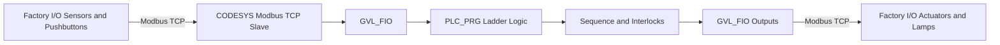
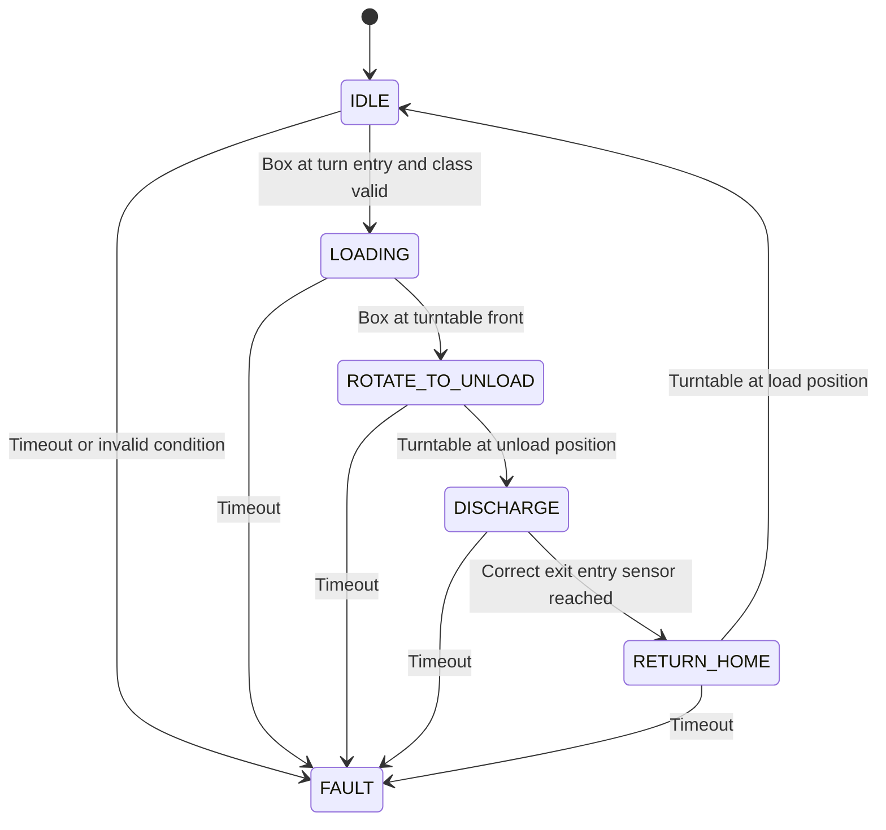

# CODESYS + Factory I/O Industrial Sorting Cell

Industrial PLC portfolio project implementing an automated material handling and height sorting cell using **CODESYS Ladder Diagram (LD)**, **Factory I/O**, and **Modbus TCP**.

## Project Objective

Control the Factory I/O **Sorting by Height (Advanced)** scene with an industrial style PLC architecture. The system detects box height, transfers each box onto a turntable, sorts high boxes to the right line and low boxes to the left line, verifies discharge, and handles common abnormal conditions.

This repository intentionally goes beyond a basic start/stop conveyor exercise. It adds operating modes, permissives, state based sequencing, jam timeouts, latched faults, controlled reset, production counters, manual maintenance commands, and commissioning tests.

## Technology Stack

| Layer | Technology |
|---|---|
| Virtual plant | Factory I/O |
| PLC engineering | CODESYS V3.5 |
| PLC language | IEC 61131-3 Ladder Diagram |
| PLC runtime | CODESYS Control Win V3 |
| Industrial communication | Modbus TCP |
| Version control | Git / GitHub |

## Functional Scope

1. Start, stop, reset, and simulated emergency stop.
2. Auto and Manual operating modes.
3. Box presence tracking on the entry conveyor.
4. Height classification with Low and High sensor memory.
5. Turntable sequence using one hot state bits.
6. High box routing to the right discharge conveyor.
7. Low box routing to the left discharge conveyor.
8. Exit conveyor occupancy tracking.
9. Timeout based jam and motion fault detection.
10. Latched fault and controlled reset.
11. Total, high, low, and fault counters.
12. Run, Auto, and Fault indication outputs.
13. Commissioning and acceptance test matrix.

## Control Architecture



## Automatic Sequence



## Repository Structure

```text
codesys-factoryio-industrial-sorting-cell/
├── README.md
├── LICENSE
├── PROJECT_STATUS.md
├── docs/
│   ├── control-philosophy.md
│   ├── sequence-of-operation.md
│   ├── io-list.csv
│   ├── fault-matrix.md
│   ├── acceptance-test-plan.md
│   └── portfolio-evidence-plan.md
├── plc/
│   ├── GVL_FIO.txt
│   ├── GVL_HMI.txt
│   ├── PLC_PRG_declaration.txt
│   └── ladder-networks.md
├── factoryio/
│   ├── setup.md
│   └── tag-map.csv
├── screenshots/
│   └── README.md
└── .github/workflows/
    └── markdown.yml
```

## Quick Start

1. Install CODESYS V3.5 and a CODESYS Control Win V3 runtime.
2. Open Factory I/O and save a copy of **Sorting by Height (Advanced)** under My Scenes.
3. Add Start, Stop NC, Reset, E Stop NC, Auto selector, Run lamp, Auto lamp, and Fault lamp to the copied scene.
4. In CODESYS create a Standard Project using CODESYS Control Win V3 and select Ladder Diagram for `PLC_PRG`.
5. Create global variable lists using `plc/GVL_FIO.txt` and `plc/GVL_HMI.txt`.
6. Add local variables from `plc/PLC_PRG_declaration.txt`.
7. Build each Ladder network exactly as specified in `plc/ladder-networks.md`.
8. Configure Modbus TCP using `factoryio/setup.md` and `factoryio/tag-map.csv`.
9. Run the acceptance tests in `docs/acceptance-test-plan.md`.
10. Capture evidence listed in `docs/portfolio-evidence-plan.md` before publishing the repository.

## Engineering Design Intent

The project uses explicit state bits instead of long chains of timers. Timers are used primarily for diagnostics and timeout supervision. Automatic outputs are driven from machine state and permissives. Manual commands remain separated from automatic sequencing and are only enabled when Manual mode is selected and the safety simulation permissive is healthy.

The emergency stop in this project is a **simulation signal only**. It must not be presented as a real safety PLC or machine safety implementation.

## Current Validation State

The engineering package is design complete, but the generated repository has **not been compiled or runtime tested inside CODESYS or Factory I/O in this environment**. Commission the project using the included test plan and record evidence before claiming verified operation.

## Recommended Portfolio Title

**Industrial Automated Sorting and Material Handling Cell | CODESYS LD + Factory I/O + Modbus TCP**

## GitHub About

Industrial PLC portfolio project using CODESYS Ladder and Factory I/O with Modbus TCP, sequencing, interlocks, diagnostics, fault recovery, and production counters.

## Suggested GitHub Topics

`codesys` `factory-io` `plc` `ladder-logic` `iec61131-3` `industrial-automation` `modbus-tcp` `control-systems` `manufacturing` `ot`

## References

Factory I/O CODESYS tutorials and samples: https://docs.factoryio.com/tutorials/codesys/

Factory I/O CODESYS Modbus TCP setup for SP16 or higher: https://docs.factoryio.com/tutorials/codesys/setting-up/codesys-mb-sp16/

CODESYS Ladder documentation: https://content.helpme-codesys.com/en/CODESYS%20Ladder/_ld_overview.html
